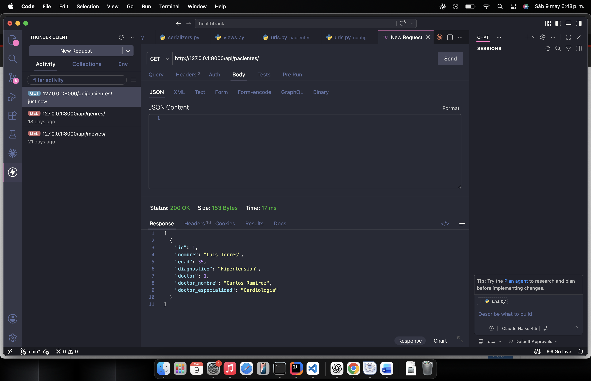
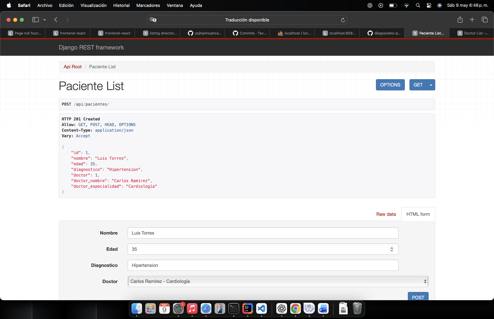
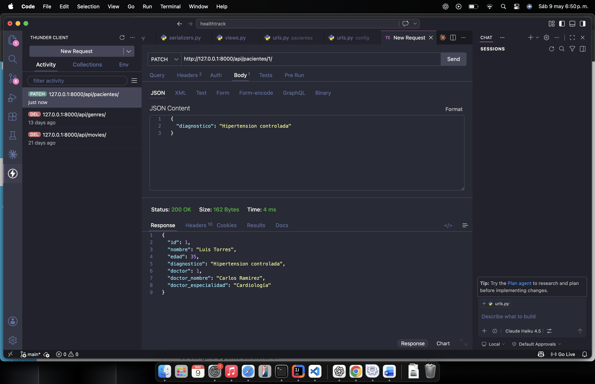
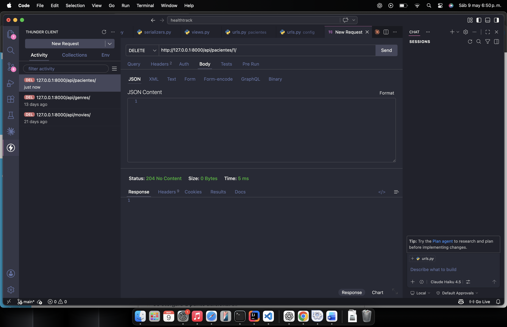
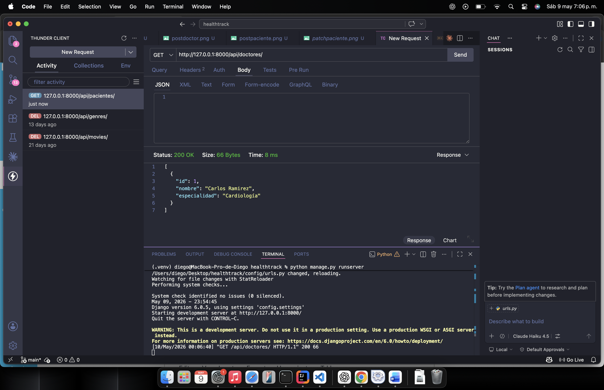
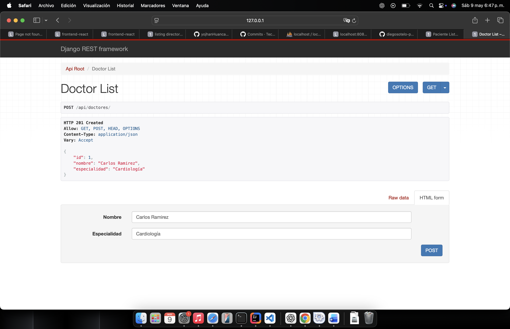
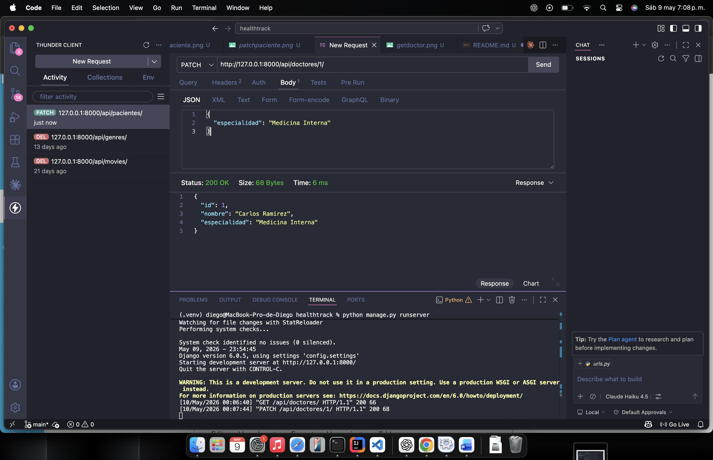
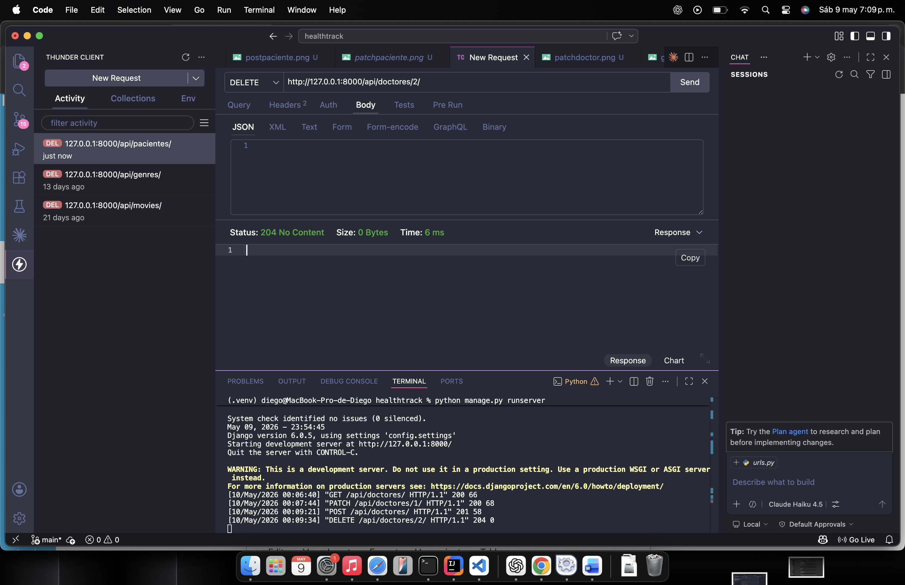

# HealthTrack API

## Descripción breve del proyecto

HealthTrack API es una API REST desarrollada con Django y Django REST Framework.

El proyecto permite administrar pacientes y doctores. Cada paciente contiene información básica como nombre, edad y diagnóstico. Además, cada paciente está relacionado con un doctor asignado, quien cuenta con datos como nombre y especialidad médica.

La gestión de la información se realiza exclusivamente mediante endpoints de Django REST Framework, sin utilizar Django Admin como interfaz de gestión.

---

## Tecnologías usadas

- Python
- Django
- Django REST Framework
- SQLite
- Git
- GitHub
- Thunder Client

---

## Instrucciones para ejecutar el servidor

### 1. Clonar el repositorio

```bash
git clone https://github.com/diegosotelo-png/healthtrackapi.git
```

### 2. Entrar a la carpeta del proyecto

```bash
cd healthtrackapi
```

### 3. Crear entorno virtual

```bash
python3 -m venv .venv
```

### 4. Activar entorno virtual

En macOS o Linux:

```bash
source .venv/bin/activate
```

En Windows:

```bash
.venv\Scripts\activate
```

### 5. Instalar dependencias

```bash
pip install django djangorestframework django-filter
```

### 6. Ejecutar migraciones

```bash
python manage.py makemigrations
python manage.py migrate
```

### 7. Ejecutar el servidor

```bash
python manage.py runserver
```

El servidor se ejecutará en:

```text
http://127.0.0.1:8000/
```

---

## Endpoints disponibles

### Entidad 1: Pacientes

| Método | Endpoint | Descripción |
|---|---|---|
| GET | `/api/pacientes/` | Lista todos los pacientes registrados |
| POST | `/api/pacientes/` | Crea un nuevo paciente |
| GET | `/api/pacientes/{id}/` | Muestra un paciente específico por ID |
| PUT | `/api/pacientes/{id}/` | Actualiza completamente un paciente |
| PATCH | `/api/pacientes/{id}/` | Actualiza parcialmente un paciente |
| DELETE | `/api/pacientes/{id}/` | Elimina un paciente |
| GET | `/api/pacientes/?search=texto` | Busca pacientes por nombre, diagnóstico, doctor o especialidad |

### Entidad 2: Doctores

| Método | Endpoint | Descripción |
|---|---|---|
| GET | `/api/doctores/` | Lista todos los doctores registrados |
| POST | `/api/doctores/` | Crea un nuevo doctor |
| GET | `/api/doctores/{id}/` | Muestra un doctor específico por ID |
| PUT | `/api/doctores/{id}/` | Actualiza completamente un doctor |
| PATCH | `/api/doctores/{id}/` | Actualiza parcialmente un doctor |
| DELETE | `/api/doctores/{id}/` | Elimina un doctor |

---

## Ejemplos de uso

### Crear un doctor

Endpoint:

```text
POST /api/doctores/
```

Body JSON:

```json
{
  "nombre": "Carlos Ramirez",
  "especialidad": "Cardiologia"
}
```

Ejemplo con curl:

```bash
curl -X POST http://127.0.0.1:8000/api/doctores/ \
-H "Content-Type: application/json" \
-d '{
  "nombre": "Carlos Ramirez",
  "especialidad": "Cardiologia"
}'
```

---

### Listar doctores

Endpoint:

```text
GET /api/doctores/
```

Ejemplo con curl:

```bash
curl http://127.0.0.1:8000/api/doctores/
```

Respuesta esperada:

```json
[
  {
    "id": 1,
    "nombre": "Carlos Ramirez",
    "especialidad": "Cardiologia"
  }
]
```

---

### Actualizar parcialmente un doctor

Endpoint:

```text
PATCH /api/doctores/1/
```

Body JSON:

```json
{
  "especialidad": "Medicina Interna"
}
```

Ejemplo con curl:

```bash
curl -X PATCH http://127.0.0.1:8000/api/doctores/1/ \
-H "Content-Type: application/json" \
-d '{
  "especialidad": "Medicina Interna"
}'
```

---

### Eliminar un doctor

Endpoint:

```text
DELETE /api/doctores/1/
```

Ejemplo con curl:

```bash
curl -X DELETE http://127.0.0.1:8000/api/doctores/1/
```

---

### Crear un paciente

Endpoint:

```text
POST /api/pacientes/
```

Body JSON:

```json
{
  "nombre": "Luis Torres",
  "edad": 35,
  "diagnostico": "Hipertension",
  "doctor": 1
}
```

Ejemplo con curl:

```bash
curl -X POST http://127.0.0.1:8000/api/pacientes/ \
-H "Content-Type: application/json" \
-d '{
  "nombre": "Luis Torres",
  "edad": 35,
  "diagnostico": "Hipertension",
  "doctor": 1
}'
```

---

### Listar pacientes

Endpoint:

```text
GET /api/pacientes/
```

Ejemplo con curl:

```bash
curl http://127.0.0.1:8000/api/pacientes/
```

Respuesta esperada:

```json
[
  {
    "id": 1,
    "nombre": "Luis Torres",
    "edad": 35,
    "diagnostico": "Hipertension",
    "doctor": 1,
    "doctor_nombre": "Carlos Ramirez",
    "doctor_especialidad": "Cardiologia"
  }
]
```

---

### Buscar pacientes

Endpoint:

```text
GET /api/pacientes/?search=cardiologia
```

Ejemplo con curl:

```bash
curl "http://127.0.0.1:8000/api/pacientes/?search=cardiologia"
```

Descripción:

Este endpoint permite buscar pacientes por nombre, diagnóstico, nombre del doctor o especialidad médica.

---

### Actualizar parcialmente un paciente

Endpoint:

```text
PATCH /api/pacientes/1/
```

Body JSON:

```json
{
  "diagnostico": "Hipertension controlada"
}
```

Ejemplo con curl:

```bash
curl -X PATCH http://127.0.0.1:8000/api/pacientes/1/ \
-H "Content-Type: application/json" \
-d '{
  "diagnostico": "Hipertension controlada"
}'
```

---

### Eliminar un paciente

Endpoint:

```text
DELETE /api/pacientes/1/
```

Ejemplo con curl:

```bash
curl -X DELETE http://127.0.0.1:8000/api/pacientes/1/
```

---

## Relación paciente-doctor

Cada paciente está relacionado con un doctor mediante una llave foránea.

Además, la respuesta del endpoint de pacientes fue personalizada para mostrar información del doctor asignado.

Ejemplo:

```json
{
  "id": 1,
  "nombre": "Luis Torres",
  "edad": 35,
  "diagnostico": "Hipertension",
  "doctor": 1,
  "doctor_nombre": "Carlos Ramirez",
  "doctor_especialidad": "Cardiologia"
}
```

---

## Evidencias del Proyecto

### Listado de pacientes



### Creación de paciente



### Actualización de paciente



### Eliminación de paciente



### Listado de doctores



### Creación de doctor



### Actualización de doctor



### Eliminación de doctor



### Búsqueda y relación paciente-doctor


---

## Funcionalidades implementadas

| Funcionalidad | Estado |
|---|---|
| Listado general de pacientes | Implementado |
| Creación de pacientes | Implementado |
| Edición de pacientes | Implementado |
| Eliminación de pacientes | Implementado |
| Búsqueda de pacientes con `search` | Implementado |
| Relación entre pacientes y doctores | Implementado |
| CRUD básico de doctores | Implementado |
| Respuesta personalizada con datos del doctor | Implementado |

---

## Repositorio

```text
https://github.com/diegosotelo-png/healthtrackapi
```

---

## Autor

Diego Sotelo